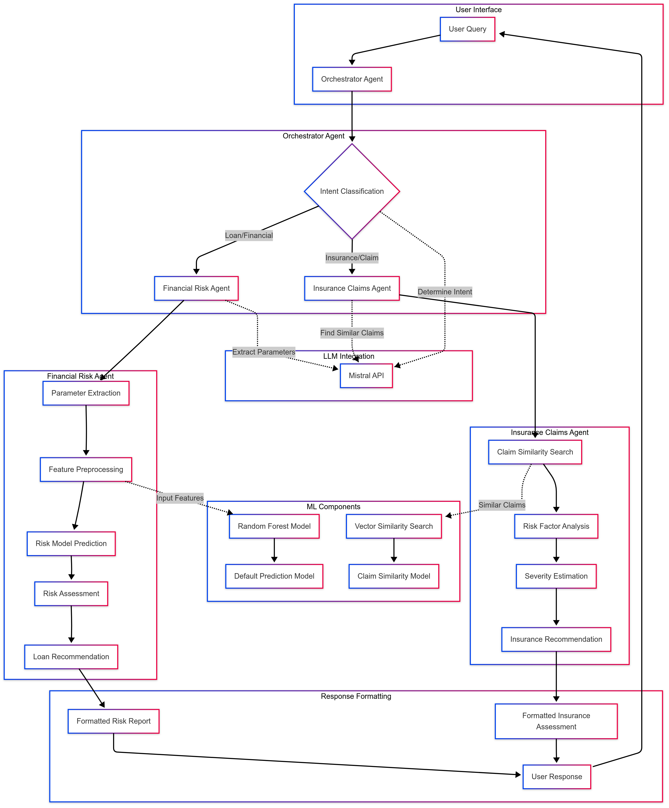

<h1 align = "center">FINORA</h1>
<h2 align = "center">Smarter Lending, Faster Approvals</h2>
<p align = "justify">FINORA accelerates loan approvals with precision by leveraging Mistral LLM + Random Forest Classifier to optimize risk assessment and decision making.</p>
<p align = "justify">Trained on a set of 300 custom and predefined queries and a dataset of 45k data containing parameters like Credit Amount, Credit Loan History, previous defaults, CIBIL SCORE etc, we used an Agentic A.I approach for smarter and faster Loan and Insurance approval.
  
  - Loan Agent : Manages the approval or rejection of loan with a strict set of rules for minimum CIBIL score, age and every type of authentication.
  - Insurance Agent : Manages Insurance claims - checking the severity, cause, intention for claim, documents required for further verification.
  - Orchestrator Agent : Manages and switches between the Loan and Insurance Agent.

USP OF OUR MODEL:
1. Faster loan approval with an accuracy of 93%.
2. Claims can be made using simpler prompts, as well as well explained details of the need of documents as well as highlighting the keywords while making the claim.
3. Interest rate offered is in the middle ground so that neither the bank not customer suffer's. (Taken on parameters based on the employment duration, credit score, loan amount and current salary.

Work pending : Creating a vector database.

<p align="center"></p>
References

```
https://papertalk.org/papertalks/6134
```

```
https://www.researchgate.net/figure/Fitted-Lorentzian-curve-fitting-LCF-method-on-a-noisy-Brillouin-gain-spectrum-BGS_fig3_344655338
```
