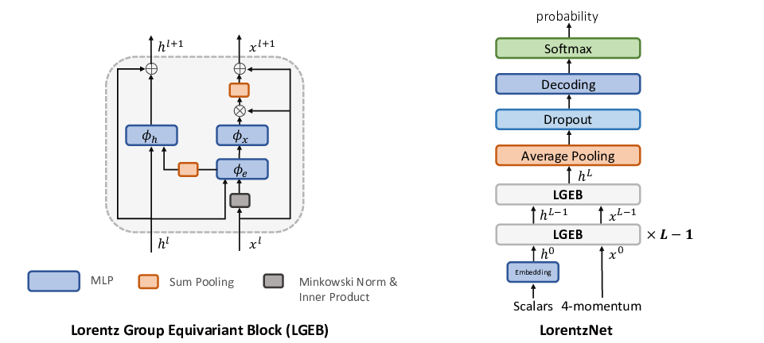
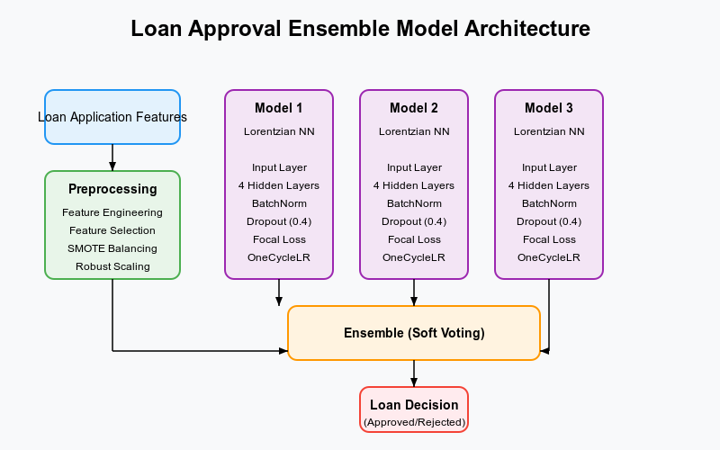

<h1 align = "center"> STRYDE</h1>
<h2 align = "center">Strategic-Transaction-Risk-Yield-Decision-Engine </h2>
<p align = "justify">STRYDE accelerates loan approvals with precision by leveraging Lorentzian Neural Networks to optimize risk assessment and decision making.

- Loan approval takes around 3-4 days from acceptance to approval, we are aiming to provide that in just a couple of hours (and will work it through for making it to minutes), without tampering with the accuracy.
- Our model provides a hybrid structure integrating Lorentzian Neural Networks along with Ensemble Methods for accuracy boost to ensure that the loan approval is handled with the atmost care.
</p>






<p align = "justify">Model architecture and overall flow for the model.</p>


References

```
https://papertalk.org/papertalks/6134
```

```
https://www.researchgate.net/figure/Fitted-Lorentzian-curve-fitting-LCF-method-on-a-noisy-Brillouin-gain-spectrum-BGS_fig3_344655338
```
